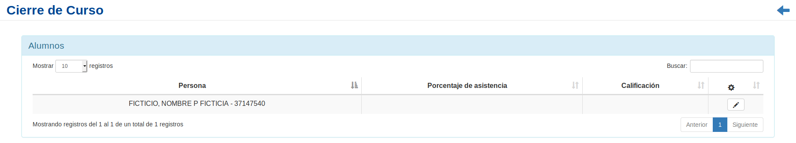
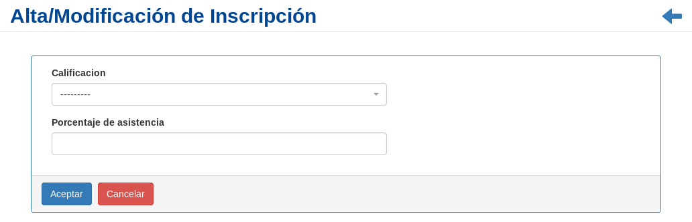

Cierre del Curso
================
Se presentará una pantalla que contendrá un listado con todos los alumnos inscriptos en un *Curso* particular
que se encuentra registrado en el sistema hasta la fecha.

Junto con el listado, se presentarán un conjunto de funcionalidades que permitirán manipular cada *Alumno inscripto en el curso*.

Estas funcionalidades son:

- :ref:`Modificar Calificación/Asistencia <modificar-inscripcion_alumno>`

.. _modificar-inscripcion_alumno:

Modificar Calificación/Asistencia del Alumno
--------------------------------------------

Si el usuario desea agregar los datos de una *Calificación/Asistencia* de un alumno, deberá seleccionar en la columna de **acciones** asociado a la *Inscripción* y presionar el ícono ``Modificar``.

Una vez realizado el paso anterior, el sistema lo redirigirá a la siguiente pantalla:

En esta parte al usuario se le presentará un formulario y deberá actualizar los datos asociados a la *Inscripción*.

.. ATTENTION::

    SOLO SE PODRÁ INGRESAR EL PORCENTAJE DE ASISTENCIA Y CALIFICACIÓN UNA SOLA VEZ LUEGO DE INGRESAR LOS DATOS Y POSTERIORMENTE CONFIRMARLOS.

    El sistema no permitirá volver a modificar los datos del alumno.

Una vez completado el formulario, el usuario deberá presionar el botón ``Aceptar`` y el sistema se encargará de actualizar los datos de la *Inscripción* seleccionada.
