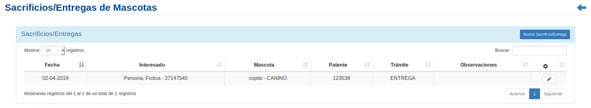

Sacrificios/Entregas de animales
================================

Se presentará una pantalla que contendrá un listado con todos los *Sacrificios/Entregas de animales*
que se encuentren registrados en el sistema hasta la fecha.

Junto con el listado, se presentarán un conjunto de funcionalidades que permitirán manipular cada *Esterilización*.

Estas funcionalidades son:

- :ref:`Modificar sacrifio/entrega <modificar-s_e>`

Además, si el usuario desea Registrar un nuevo *Sacrificio/Entrega*:

- :ref:`Nuevo Sacrificio/Entrega <nuevo-s_e>`

.. _nuevo-s_e:

Nuevo Sacrificio/Entrega
-------------------------

  Si el usuario desea crear un nuevo *Sacrificio/Entrega*, deberá presionar el botón ``Nuevo Sacrificio/Entrega``.

  A continuación el sistema lo redirigirá a la siguiente pantalla:

  .. image:: _static/alta_s_e.png
    :align: center

  El usuario deberá ingresar los datos solicitados por el formulario. A continuación deberá escoger si el animal está patentando o no.

  Si selecciona la opción ``patentado`` el sistema mostrará la siguiente pantalla:

  .. image:: _static/alta_s_e_patente.png
    :align: center

  A continuación el usuario seleccionará la patente existente y el sistema luego de crear el registro solicitado lo redigirá al listado inicial.

  Si por otro lado el usuario NO selecciona la opción ``patentado`` , el sistema mostrará el nuevo formulario:

  .. image:: _static/alta_sin_patente_s_e.png
    :align: center

  Una vez que el usuario complete el formulario, el sistema lo redigirá al listando principal.

  .. ATTENTION::
      El sistema siempre validará que la información ingresada sea correcta. En caso de que los datos ingresados sean incorrectos el sistema lo informará.
      En este punto, las posibles causas de errores son:

          - Uno o más campos obligatorios vacíos.
          - Uno o más campos con un formato incorrecto.

.. _modificar-s_e:

Modificación Sacrificio/Entrega
-------------------------------

  Si el usuario desea modificar los datos de un *Sacrificio/Entrega*, deberá seleccionar en la columna de **acciones** asociado al *Curso* y presionar el ícono ``Modificar``.

  Una vez realizado el paso anterior, el sistema lo redirigirá a la siguiente pantalla:

  .. image:: _static/modificar_s_e.png
    :align: center

  En esta parte al usuario se le presentará un formulario y deberá actualizar los datos asociados al *Sacrificio/Entrega*.
