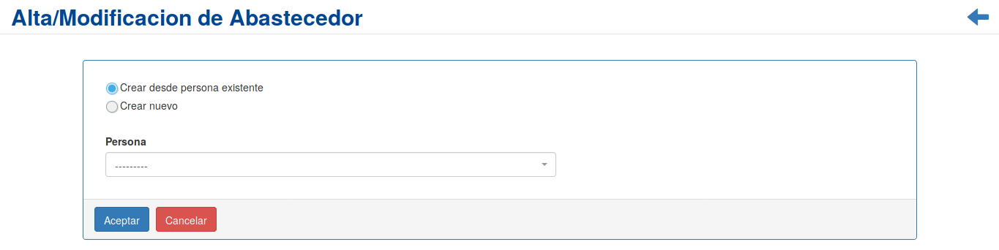
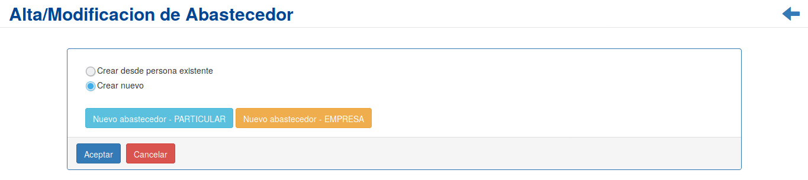
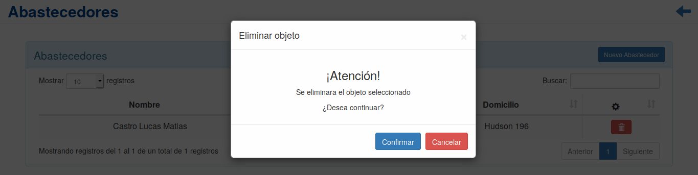

Abastecedores
=============
Se presentará una pantalla que contendrá un listado con todos los *Abastecedores* que se encuentren registrados en el sistema hasta la fecha.
Junto con el listado, se presentarán un conjunto de funcionalidades que permitirán manipular cada *Abastecedor*.

.. image:: _static/listado_abastecedores.png
    :align: center

Estas funcionalidades son:

  - :ref:`Nuevo Abastecedor <nuevo-abastecedor>`
  - :ref:`Eliminar Abastecedor <eliminar-abastecedor>`

.. _nuevo-abastecedor:

Nuevo abastecedor
-----------------

Si el usuario desea crear un nuevo *Abastecedor*, deberá presionar el botón ``Nuevo Abastecedor``.

A continuación el sistema lo redirigirá a una pantalla en la cual podra:

- Dar de alta como abastecedor a una persona previamente creada en el sistema:
    

    
- Crear un nuevo abastecedor particular o empresa:
    

  
En caso de seleccionar la opción de crear un nuevo abastecedor, el usuario sera redirigido a un formulario, el cual debera completar para finalizar la creación del nuevo abastecedor.

.. ATTENTION::
    El sistema siempre validará que la información ingresada sea correcta. En caso de que los datos ingresados sean incorrectos el sistema lo informará.
    En este punto, las posibles causas de errores son:

        - Uno o más campos obligatorios vacíos.
        - Uno o más campos con un formato incorrecto.

Cabe aclarar que al momento de registrar un nuevo abastecedor en el sistema, se creara de manera automatica una cuenta corriente para el mismo.
        
Una vez completado el formulario, se volverá  a la pantalla que contendrá el listado de Abastecedores.

.. _eliminar-abastecedor:

Eliminar Abastecedor
--------------------

Si el usuario desea eliminar un *Abastecedor*, deberá seleccionar en la columna de **acciones** asociado al *Abastecedor* y presionar el ícono ``Eliminar``

Una vez realizado el paso anterior aparecerá la siguiente ventana emergente (modal):

En esta parte el usuario deberá decidir si confirma la eliminación del *Abastecedor* o no. Si desea confirmar la eliminación deberá presionar el botón ``Confirmar``, caso contrario, presionará el botón ``Cancelar``.
