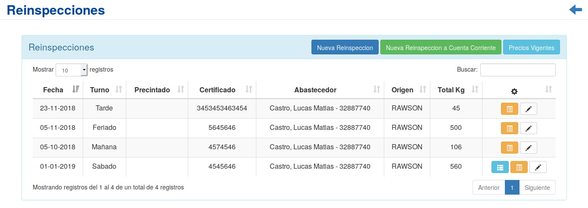
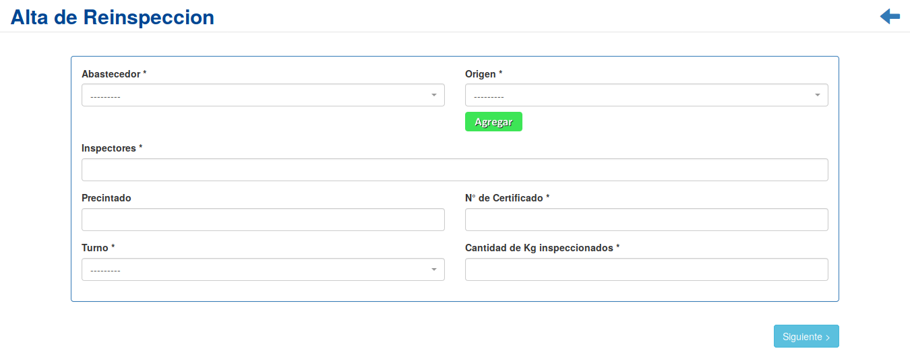
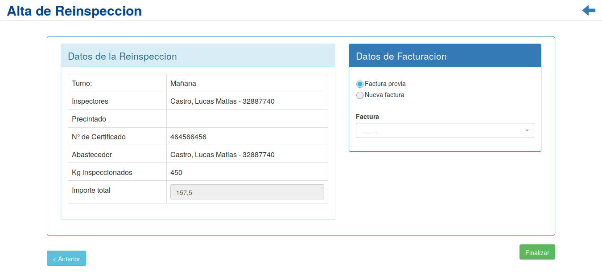
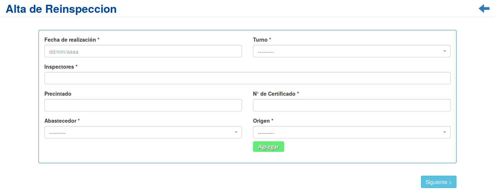
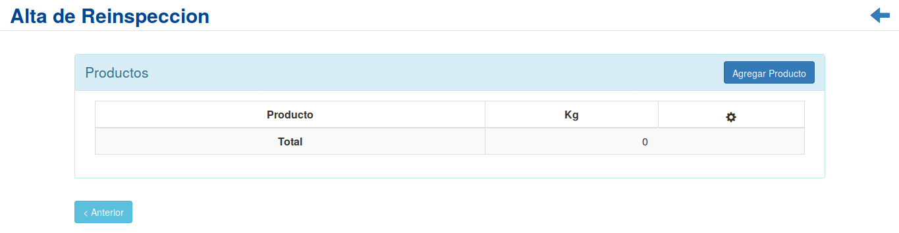
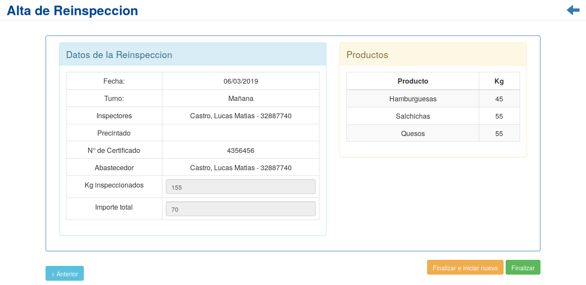
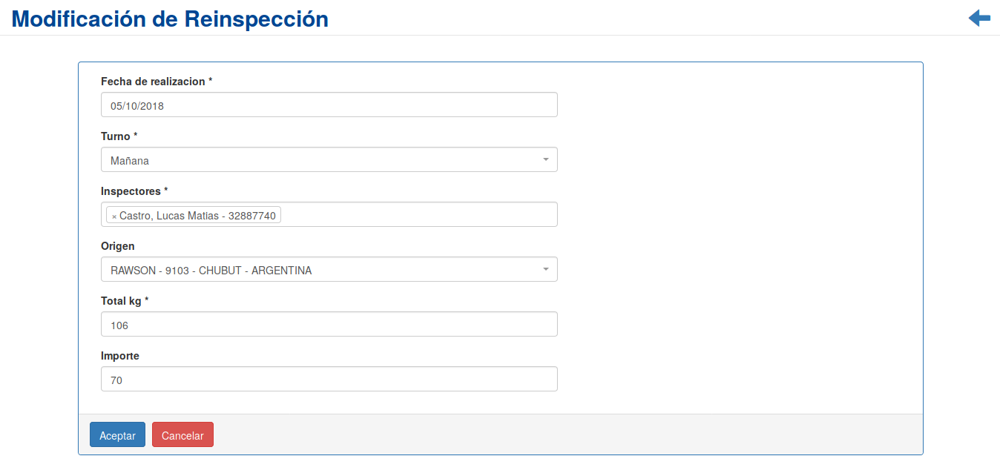
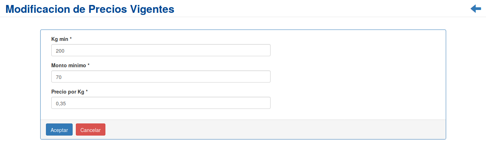
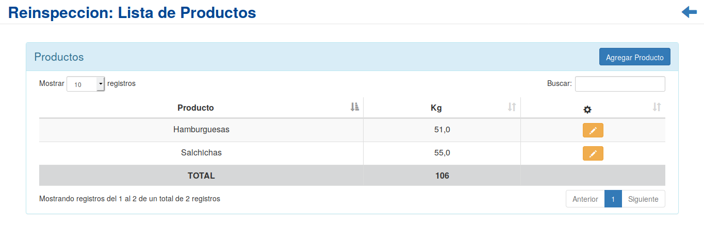

Reinspecciones
==============
Se presentará una pantalla que contendrá un listado con todos las *Reinspecciones* que se encuentren registradas en el sistema hasta la fecha.

Junto con el listado, se presentarán un conjunto de funcionalidades que permitirán manipular cada *Reinspección*. Estas funcionalidades son:

  - :ref:`Nueva Reinspección <nueva-reinspeccion>`
  - :ref:`Nueva Reinspección en Cuenta Corriente <nueva-reinspeccion-cc>`
  - :ref:`Modificar Reinspección <modificar-reinspeccion>`
  - :ref:`Precios Vigentes <precios-vigentes>`
  - :ref:`Lista de Productos <lista-productos>`
  - :ref:`Carga de Productos <carga-productos>`

.. _nueva-reinspeccion:

Nueva Reinspección
------------------

Si el usuario desea crear una nueva *Reinspección*, deberá presionar el botón ``Nueva Reinspección``.

A continuación el sistema lo redirigirá a la siguiente pantalla:

En esta pantalla el usuario deberá ingresar los datos solicitados para dar de alta una nueva *Reinspección*. Acto seguido, se presentará un resumen de los datos ingresados, el valor calculado de la reinspección, y se solicitara al usuario que ingrese los datos de facturación.

.. ATTENTION::
    El sistema siempre validará que la información ingresada sea correcta. En caso de que los datos ingresados sean incorrectos el sistema lo informará.
    En este punto, las posibles causas de errores son:

        - Uno o más campos obligatorios vacíos.
        - Uno o más campos con un formato incorrecto.

Una vez completado el formulario, se volverá  a la pantalla del listado de reinspecciones.

.. _nueva-reinspeccion-cc:

Nueva Reinspección en Cuenta Corriente
--------------------------------------

Si el usuario desea crear una nueva *Reinspección* a ser cargada en *Cuenta Corriente*, deberá presionar el botón ``Nueva Reinspección en Cuenta Corriente``.

En esta parte el usuario se le presentará una serie de pasos y deberá ingresar los datos solicitados para dar de alta una nueva *Reinspección*.

El primer paso es el siguiente formulario:

Una vez completado el formulario, se continuara a la pantalla de carga de productos:

Para finalizar, se mostrara un resumen de la reinspeccion a cargar.

     
.. ATTENTION::
    El sistema siempre validará que la información ingresada sea correcta. En caso de que los datos ingresados sean incorrectos el sistema lo informará.
    En este punto, las posibles causas de errores son:

        - Uno o más campos obligatorios vacíos.
        - Uno o más campos con un formato incorrecto.

Una vez completados todos los pasos requeridos, se podra seleccionar volver al listado de reinspecciones, o registrar una nueva reinspeccion en cuenta corriente.

.. _modificar-reinspeccion:

Modificar Reinspeccion
----------------------

Si el usuario desea modificar los datos de una *Reinspección*, deberá seleccionar en la columna de **acciones** asociado a la *Reinspección* y presionar el ícono ``Modificar``.

Una vez realizado el paso anterior, el sistema lo redirigirá a la siguiente pantalla:

En esta parte al usuario se le presentará un formulario y deberá actualizar los datos asociados a la *Reinspección*.

.. ATTENTION::

    El sistema recopilará los datos registrados de la Reinspección y los mostrará para modificarlos, además, siempre validará que la información ingresada sea correcta. En caso de que los datos ingresados sean incorrectos el sistema lo informará.
    En este punto, las posibles causas de errores son:

        - Uno o más campos con un formato incorrecto.

Una vez completado el formulario, el usuario deberá presionar el botón ``Aceptar`` y el sistema se encargará de actualizar los datos de la *Reinspección* seleccionada.

.. _precios-vigentes:

Precios Vigentes
----------------

Si el usuario desea modificar los parametros de precios y kg. que rigen sobre las reinspecciones, deberá presionar el botón ``Precios Vigentes``.

A continuación el sistema lo redirigirá a la siguiente pantalla:

En este apartado, se le presentará al usuario un formulario, en el cual podra modificar los parametros de precios y kg. para las reinspecciones.

.. ATTENTION::
    El sistema siempre validará que la información ingresada sea correcta. En caso de que los datos ingresados sean incorrectos el sistema lo informará.
    En este punto, las posibles causas de errores son:

        - Uno o más campos obligatorios vacíos.
        - Uno o más campos con un formato incorrecto.

Una vez completado el formulario, el usuario deberá presionar el botón ``Aceptar`` y el sistema se encargará de actualizar los datos, caso contrario, presionará el botón ``Cancelar``. En ambos casos, el sistema volverá a la vista de reinspecciones.

.. _lista-productos:

Lista de Productos
------------------

Si el usuario desea ver el el listado de productos de una *Reinspección*, deberá seleccionar en la columna de **acciones** asociado a la *Reinspección* y presionar el ícono ``Lista de Productos``

Una vez realizado el paso anterior, el usuario sera redirigido a la siguiente pantalla:

En esta seccion, el usuario podrá verificar el listado de productos cargados en la *Reinspección*, modificar sus cantidades, o agregar productos faltantes.

.. _carga-productos:

Carga de Productos
------------------

Si el usuario desea realizar la carga de productos correspondientes una *Reinspección* abonada de manera normal, deberá seleccionar en la columna de **acciones** asociado a la *Reinspección* y presionar el ícono ``Carga de Productos``

Una vez realizado el paso anterior, se mostrara la siguiente pantalla:

.. image:: _static/carga_productos_reinspeccion.png
     :align: center

En esta ventana el usuario podrá ingresar uno por uno los productos inspeccionados, asi como su cantidad. En la parte superior derecha, se informará al usuario la cantidad de kg. inspeccionados que fueron registrados al momento de abonar la reinspección.

